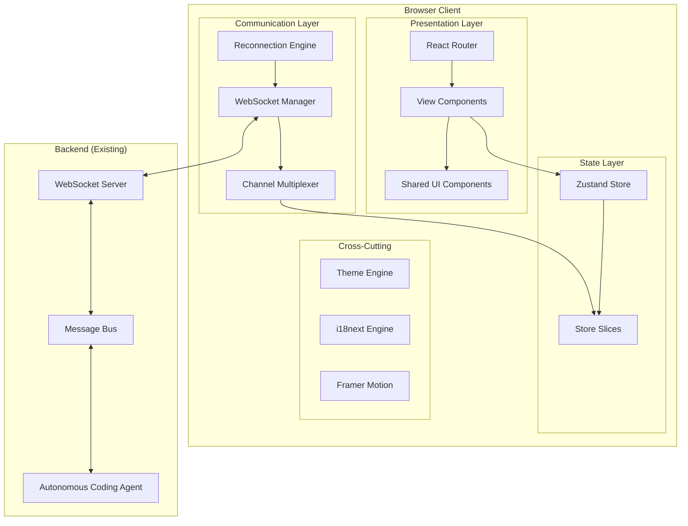
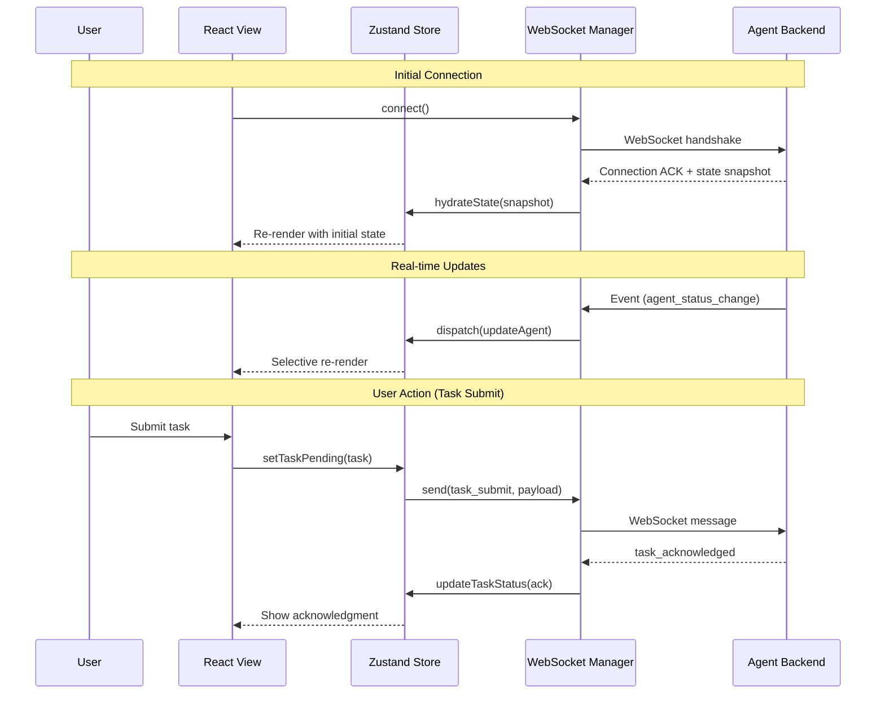
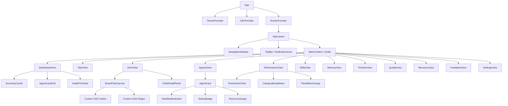
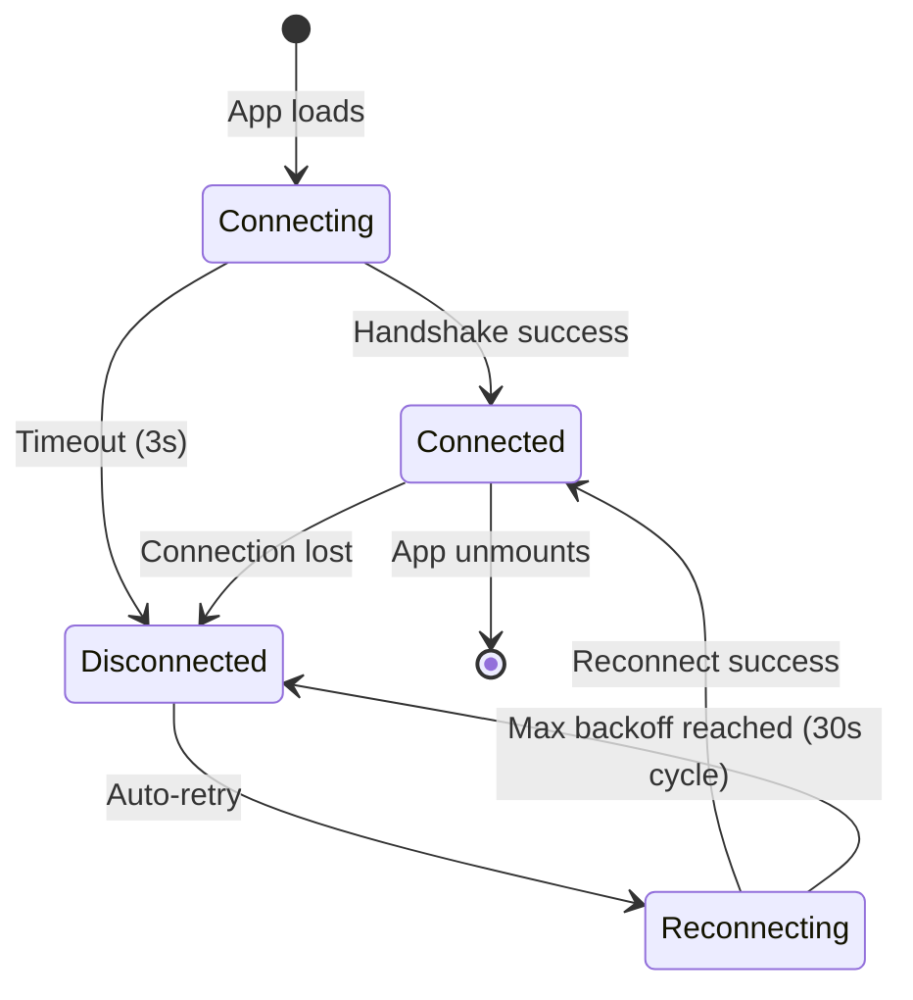

# Technical Design Document: Agent Web UI

## Overview

This document defines the technical architecture for the Agent Web UI — a modern, real-time web-based graphical interface for the Autonomous Coding Agent system. The GUI provides live visualization of agent swarm activity, interactive task submission with multilingual support (English + Arabic RTL), live DAG execution graphs, performance dashboards, skill browsing, memory exploration, version control timelines, and comprehensive system monitoring.

### Tech Stack

| Layer | Technology | Purpose |
|-------|-----------|---------|
| UI Framework | React 18+ with TypeScript | Component architecture, concurrent rendering |
| Build Tool | Vite | Fast HMR, optimized production builds |
| Styling | Tailwind CSS + custom dark theme | Utility-first CSS, theme system |
| Animations | Framer Motion | Fluid UI transitions, gesture support |
| DAG Visualization | React Flow | Interactive node-edge graph rendering |
| Charts | Recharts | Performance metric visualization |
| Real-time | WebSocket (native API) | Bidirectional server communication |
| i18n | i18next | Internationalization (EN + AR) |
| State Management | Zustand | Lightweight global state |
| Routing | React Router | Client-side navigation |

### Design Decisions

1. **Zustand over Redux**: Chosen for minimal boilerplate, built-in subscription selectors, and native TypeScript support. The app has multiple independent data domains (agents, tasks, metrics) that benefit from Zustand's store-slicing pattern.
2. **Native WebSocket over Socket.IO**: The backend already uses a message bus pattern. A thin native WebSocket layer keeps the bundle small and gives full control over reconnection logic and channel multiplexing.
3. **React Flow for DAG**: Purpose-built for node-edge diagrams with built-in zoom/pan, custom nodes, and animation support — directly addressing Requirement 3.
4. **Framer Motion over CSS transitions**: Provides declarative animation composition, layout animations, and gesture handlers needed for fluid state transitions across all views.
5. **i18next**: Industry-standard React i18n with RTL-aware formatting, lazy namespace loading, and interpolation support for dynamic content.


## Architecture

### High-Level System Diagram



### Data Flow Architecture




### Layered Architecture

The application follows a strict layered architecture:

1. **Presentation Layer** — React components, views, and UI primitives
2. **State Layer** — Zustand stores with domain-specific slices
3. **Communication Layer** — WebSocket manager with channel multiplexing and reconnection
4. **Cross-Cutting Layer** — Theme engine, i18n, animation system, and accessibility

Data flows unidirectionally: Server → WebSocket → Store → View. User actions flow: View → Store → WebSocket → Server.

## Components and Interfaces

### Component Hierarchy



### Core Component Interfaces

```typescript
// === WebSocket Manager ===
interface WebSocketManager {
  connect(url: string): void;
  disconnect(): void;
  subscribe(channel: WSChannel, handler: MessageHandler): Unsubscribe;
  send(channel: WSChannel, payload: unknown): void;
  getConnectionStatus(): ConnectionStatus;
  onStatusChange(handler: (status: ConnectionStatus) => void): Unsubscribe;
}

type WSChannel = 'agents' | 'tasks' | 'metrics' | 'alerts' | 'dag' | 'control';
type ConnectionStatus = 'connecting' | 'connected' | 'disconnected' | 'reconnecting';
type Unsubscribe = () => void;
type MessageHandler = (message: WSMessage) => void;

interface WSMessage {
  id: string;
  channel: WSChannel;
  type: string;
  payload: unknown;
  timestamp: number;
  correlationId?: string;
}
```


```typescript
// === Reconnection Engine ===
interface ReconnectionEngine {
  start(): void;
  stop(): void;
  reset(): void;
  getAttemptCount(): number;
  getNextDelay(): number; // exponential backoff: min(1s * 2^attempt, 30s)
}

// === Channel Multiplexer ===
interface ChannelMultiplexer {
  registerChannel(channel: WSChannel, handler: MessageHandler): void;
  unregisterChannel(channel: WSChannel): void;
  routeMessage(raw: string): void;
  getActiveChannels(): WSChannel[];
}
```

```typescript
// === Zustand Store Slices ===

// Connection Slice
interface ConnectionSlice {
  status: ConnectionStatus;
  lastConnected: number | null;
  reconnectAttempt: number;
  missedEvents: WSMessage[];
  setStatus: (status: ConnectionStatus) => void;
  queueMissedEvent: (event: WSMessage) => void;
  replayMissedEvents: () => void;
}

// Agents Slice
interface AgentsSlice {
  agents: Map<string, AgentState>;
  selectedAgentId: string | null;
  updateAgent: (id: string, update: Partial<AgentState>) => void;
  removeAgent: (id: string) => void;
  selectAgent: (id: string | null) => void;
  hydrateAgents: (agents: AgentState[]) => void;
}

interface AgentState {
  id: string;
  type: AgentType;
  specialization: string;
  status: AgentStatus;
  assignedTaskName: string;
  resourceUtilization: number; // 0-100 percentage
  lastHeartbeat: number;
  startTime: number;
}

// Tasks Slice
interface TasksSlice {
  tasks: Map<string, TaskState>;
  taskHistory: TaskHistoryEntry[];
  activeTaskId: string | null;
  submitTask: (description: string, language: string) => void;
  updateTask: (id: string, update: Partial<TaskState>) => void;
  setActiveTask: (id: string | null) => void;
}

interface TaskState {
  id: string;
  description: string;
  language: string;
  status: TaskStatus;
  submittedAt: number;
  clarifyingQuestions?: ClarifyingQuestion[];
  result?: TaskResultSummary;
}

interface TaskHistoryEntry {
  id: string;
  description: string;
  status: TaskStatus;
  submittedAt: number;
  completedAt?: number;
}

interface ClarifyingQuestion {
  id: string;
  question: string;
  options?: string[];
  answered: boolean;
  answer?: string;
}
```


```typescript
// DAG Slice
interface DAGSlice {
  nodes: Map<string, DAGNodeState>;
  edges: DAGEdgeState[];
  criticalPath: string[];
  selectedNodeId: string | null;
  parallelismMetrics: ParallelismMetrics | null;
  updateNodeStatus: (id: string, status: SubTaskStatus) => void;
  setDAG: (nodes: DAGNodeState[], edges: DAGEdgeState[]) => void;
  selectNode: (id: string | null) => void;
  setCriticalPath: (path: string[]) => void;
}

interface DAGNodeState {
  id: string;
  label: string;
  description: string;
  status: SubTaskStatus;
  assignedAgent?: string;
  estimatedDuration: number;
  actualDuration?: number;
  outputPreview?: string;
  position: { x: number; y: number };
}

type SubTaskStatus = 'pending' | 'running' | 'completed' | 'failed' | 'recovering';

interface DAGEdgeState {
  id: string;
  source: string;
  target: string;
  isCriticalPath: boolean;
}

// Performance Slice
interface PerformanceSlice {
  timeSeries: TimeSeriesData[];
  categoryBreakdown: CategoryMetric[];
  parallelismEfficiency: ParallelismMetrics | null;
  selectedTimeRange: TimeRange;
  optimizationFlags: OptimizationFlag[];
  setTimeRange: (range: TimeRange) => void;
  addDataPoint: (point: TimeSeriesDataPoint) => void;
  setOptimizationFlags: (flags: OptimizationFlag[]) => void;
}

type TimeRange = '1h' | '24h' | '7d' | '30d';

interface TimeSeriesData {
  metric: 'executionTime' | 'throughput' | 'errorRate' | 'resourceUtilization';
  points: TimeSeriesDataPoint[];
}

interface TimeSeriesDataPoint {
  timestamp: number;
  value: number;
  metadata?: Record<string, unknown>;
}

interface CategoryMetric {
  category: string;
  successRate: number;
  avgDuration: number;
  improvementTrend: number; // percentage change
  taskCount: number;
}

interface OptimizationFlag {
  operationType: string;
  timestamp: number;
  suggestion: string;
  priority: 'low' | 'medium' | 'high' | 'critical';
}
```


```typescript
// Skills Slice
interface SkillsSlice {
  skills: SkillModule[];
  filteredSkills: SkillModule[];
  selectedSkillId: string | null;
  searchQuery: string;
  sortField: SkillSortField;
  sortDirection: 'asc' | 'desc';
  filters: SkillFilters;
  setSearch: (query: string) => void;
  setSort: (field: SkillSortField, direction: 'asc' | 'desc') => void;
  setFilters: (filters: Partial<SkillFilters>) => void;
  selectSkill: (id: string | null) => void;
}

type SkillSortField = 'confidence' | 'usageCount' | 'createdAt' | 'successRate';

interface SkillFilters {
  categories?: string[];
  languages?: string[];
  minConfidence?: number;
  hasRefinementBadge?: boolean;
}

// Memory Slice
interface MemorySlice {
  namespaces: NamespaceInfo[];
  currentNamespace: MemoryNamespace | null;
  entries: MemoryEntryView[];
  selectedEntry: MemoryEntryView | null;
  searchQuery: string;
  currentPage: number;
  totalPages: number;
  selectNamespace: (ns: MemoryNamespace) => void;
  searchMemory: (query: string) => void;
  selectEntry: (entry: MemoryEntryView | null) => void;
  setPage: (page: number) => void;
}

interface NamespaceInfo {
  namespace: MemoryNamespace;
  entryCount: number;
  storageUtilization: number; // percentage
}

interface MemoryEntryView {
  id: string;
  namespace: MemoryNamespace;
  contentPreview: string;
  fullContent: string;
  relevanceScore: number;
  accessCount: number;
  lastAccessed: number;
  tags: string[];
  taskReference?: string;
  decayStatus: 'active' | 'decaying' | 'near-archival';
  relatedEntries?: string[];
}

// Timeline Slice
interface TimelineSlice {
  commits: CommitView[];
  checkpoints: CheckpointView[];
  branches: BranchView[];
  selectedItemId: string | null;
  selectItem: (id: string | null) => void;
  initiateRollback: (checkpointId: string) => void;
}

interface CommitView {
  id: string;
  message: string;
  timestamp: number;
  taskReference: string;
  filesChanged: number;
  linesAdded: number;
  linesRemoved: number;
  branchName: string;
}

interface CheckpointView {
  id: string;
  taskId: string;
  timestamp: number;
  fileCount: number;
  branchName: string;
}

interface BranchView {
  name: string;
  status: 'active' | 'merged' | 'abandoned';
  headCommitId: string;
  baseBranch: string;
  createdAt: number;
}
```


```typescript
// Quality Slice
interface QualitySlice {
  latestReview: ReviewResult | null;
  overallScore: number;
  issuesByCategory: Map<string, QualityIssue[]>;
  selectedIssue: QualityIssue | null;
  filterSeverity: ('error' | 'warning' | 'info')[];
  filterCategory: string[];
  reworkStatus: ReworkStatus | null;
  selectIssue: (issue: QualityIssue | null) => void;
  setFilters: (severity?: string[], category?: string[]) => void;
}

interface ReworkStatus {
  taskId: string;
  beforeCode: string;
  afterCode: string;
  agentId: string;
  status: 'in_progress' | 'completed';
}

// Recovery Slice
interface RecoverySlice {
  errors: ErrorEntryView[];
  escalations: EscalationView[];
  recoveryStats: RecoveryStats;
  selectedErrorId: string | null;
  activeDegradation: DegradationAlert | null;
  selectError: (id: string | null) => void;
}

interface ErrorEntryView {
  id: string;
  timestamp: number;
  errorType: string;
  affectedAgent: string;
  affectedTask: string;
  recoveryStatus: 'recovered' | 'escalated' | 'pending';
  stackTrace?: string;
  strategyUsed?: string;
  attempts: number;
}

interface EscalationView {
  id: string;
  summary: string;
  diagnostics: string;
  recommendations: string[];
  timestamp: number;
  resolved: boolean;
}

interface RecoveryStats {
  autoRecoveredPercent: number;
  escalatedPercent: number;
  timeRange: TimeRange;
}

// Feedback Slice
interface FeedbackSlice {
  pendingOutputs: FeedbackOutput[];
  acceptanceRates: CategoryAcceptanceRate[];
  selectedOutputId: string | null;
  submitCorrection: (outputId: string, correction: UserCorrection) => void;
  acceptOutput: (outputId: string) => void;
  rejectOutput: (outputId: string) => void;
}

interface FeedbackOutput {
  id: string;
  taskId: string;
  taskCategory: string;
  originalOutput: string;
  timestamp: number;
  status: 'pending' | 'accepted' | 'rejected' | 'corrected';
}

interface CategoryAcceptanceRate {
  category: string;
  acceptanceRate: number;
  totalTasks: number;
  trend: 'improving' | 'declining' | 'stable';
}

// Health Slice
interface HealthSlice {
  systemStatus: 'healthy' | 'degraded' | 'critical';
  activeAgentCount: number;
  taskQueueDepth: number;
  memoryUtilization: number;
  wsConnectionStatus: ConnectionStatus;
  resourceGauges: ResourceGauges;
  healthTimeline: HealthTimelineEntry[];
  serviceAlerts: ServiceAlert[];
  degradationAlerts: DegradationAlert[];
}

interface ResourceGauges {
  cpu: number; // 0-100
  memory: number; // 0-100
  network: number; // 0-100
}

interface HealthTimelineEntry {
  timestamp: number;
  status: 'healthy' | 'degraded' | 'critical';
}

interface ServiceAlert {
  serviceName: string;
  lastSeen: number;
  status: 'reachable' | 'unreachable';
}
```


```typescript
// Theme Slice
interface ThemeSlice {
  currentTheme: 'dark' | 'light';
  toggleTheme: () => void;
  setTheme: (theme: 'dark' | 'light') => void;
}

// i18n Slice
interface I18nSlice {
  locale: string; // 'en' | 'ar'
  direction: 'ltr' | 'rtl';
  setLocale: (locale: string) => void;
}

// Navigation Slice
interface NavigationSlice {
  activeView: ViewName;
  sidebarCollapsed: boolean;
  notifications: Notification[];
  setActiveView: (view: ViewName) => void;
  toggleSidebar: () => void;
  addNotification: (notification: Notification) => void;
  dismissNotification: (id: string) => void;
}

type ViewName =
  | 'dashboard' | 'tasks' | 'dag' | 'agents'
  | 'performance' | 'skills' | 'memory' | 'timeline'
  | 'quality' | 'recovery' | 'feedback' | 'settings';

interface Notification {
  id: string;
  type: 'error' | 'warning' | 'success' | 'info';
  title: string;
  message: string;
  timestamp: number;
  viewLink?: ViewName;
  dismissed: boolean;
}
```

### WebSocket Protocol

#### Message Format

All WebSocket messages follow a unified envelope format:

```typescript
interface WSEnvelope {
  id: string;            // Unique message ID (UUID v4)
  channel: WSChannel;    // Target channel for multiplexing
  type: string;          // Event type within the channel
  payload: unknown;      // Channel-specific payload
  timestamp: number;     // Server emission timestamp (Unix ms)
  correlationId?: string; // Links related messages (e.g., task lifecycle)
  version: number;       // Protocol version (starts at 1)
}
```

#### Channel Definitions

| Channel | Purpose | Message Types |
|---------|---------|---------------|
| `agents` | Agent lifecycle events | `agent_spawned`, `agent_status_change`, `agent_heartbeat`, `agent_terminated` |
| `tasks` | Task lifecycle events | `task_submitted`, `task_acknowledged`, `task_decomposed`, `task_progress`, `task_completed`, `task_failed`, `clarification_needed` |
| `metrics` | Performance data stream | `metric_update`, `baseline_change`, `optimization_flagged` |
| `alerts` | System alerts | `degradation_alert`, `escalation_alert`, `service_alert`, `recovery_complete` |
| `dag` | DAG execution events | `dag_created`, `node_status_change`, `wave_complete`, `critical_path_update` |
| `control` | Connection management | `snapshot_request`, `snapshot_response`, `subscribe`, `unsubscribe`, `ping`, `pong` |


#### Connection Lifecycle



**Reconnection Strategy:**
- Initial delay: 1 second
- Backoff multiplier: 2x
- Maximum delay: 30 seconds
- Formula: `delay = min(1000 * 2^attempt, 30000)`
- On reconnection: send `snapshot_request` to synchronize state

#### Key Message Payloads

```typescript
// Agent Events
interface AgentSpawnedPayload {
  agentId: string;
  type: AgentType;
  specialization: string;
  assignedTask: string;
  resourceAllocation: ResourceLimits;
}

interface AgentStatusChangePayload {
  agentId: string;
  previousStatus: AgentStatus;
  newStatus: AgentStatus;
  timestamp: number;
}

interface AgentHeartbeatPayload {
  agentId: string;
  resourceUsage: ResourceUsage;
  currentTaskProgress: number; // 0-100
}

// Task Events
interface TaskDecomposedPayload {
  taskId: string;
  nodes: DAGNodeState[];
  edges: DAGEdgeState[];
  criticalPath: string[];
  estimatedDuration: number;
}

interface TaskProgressPayload {
  taskId: string;
  subtaskId: string;
  status: SubTaskStatus;
  progress: number;
  agentId: string;
}

// DAG Events
interface WaveCompletePayload {
  taskId: string;
  waveIndex: number;
  completedNodes: string[];
  wallClockTime: number;
  cumulativeAgentTime: number;
}

// Control Events
interface SnapshotResponsePayload {
  agents: AgentState[];
  tasks: TaskState[];
  dag: { nodes: DAGNodeState[]; edges: DAGEdgeState[] } | null;
  health: {
    systemStatus: 'healthy' | 'degraded' | 'critical';
    resourceGauges: ResourceGauges;
  };
  timestamp: number;
}
```


## Data Models

### State Store Structure

The complete Zustand store is composed of the following slices:

```typescript
interface AppStore extends
  ConnectionSlice,
  AgentsSlice,
  TasksSlice,
  DAGSlice,
  PerformanceSlice,
  SkillsSlice,
  MemorySlice,
  TimelineSlice,
  QualitySlice,
  RecoverySlice,
  FeedbackSlice,
  HealthSlice,
  ThemeSlice,
  I18nSlice,
  NavigationSlice {}
```

### Theme Configuration

```typescript
interface ThemeConfig {
  colors: {
    background: { primary: string; secondary: string; tertiary: string };
    text: { primary: string; secondary: string; muted: string };
    accent: { primary: string; secondary: string; hover: string };
    status: {
      running: string;   // blue
      completed: string; // green
      failed: string;    // red
      warning: string;   // yellow
      pending: string;   // gray
    };
    gauge: {
      low: string;     // green, below 60%
      medium: string;  // yellow, 60-85%
      high: string;    // red, above 85%
    };
  };
  spacing: {
    xs: string; sm: string; md: string; lg: string; xl: string;
  };
  typography: {
    heading1: TypographyStyle;
    heading2: TypographyStyle;
    heading3: TypographyStyle;
    body: TypographyStyle;
    caption: TypographyStyle;
    code: TypographyStyle;
  };
  animation: {
    fast: number;    // 150ms
    normal: number;  // 300ms
    slow: number;    // 400ms
    easing: string;  // cubic-bezier(0.4, 0, 0.2, 1)
  };
  breakpoints: {
    mobile: number;   // 320px
    tablet: number;   // 768px
    desktop: number;  // 1024px
    wide: number;     // 1440px
    ultraWide: number; // 2560px
  };
}

interface TypographyStyle {
  fontSize: string;
  fontWeight: number;
  lineHeight: string;
  letterSpacing?: string;
}
```

### i18n Resource Structure

```typescript
interface I18nResources {
  [locale: string]: {
    common: {
      navigation: Record<ViewName, string>;
      status: Record<string, string>;
      actions: Record<string, string>;
    };
    dashboard: Record<string, string>;
    tasks: Record<string, string>;
    agents: Record<string, string>;
    performance: Record<string, string>;
    skills: Record<string, string>;
    memory: Record<string, string>;
    timeline: Record<string, string>;
    quality: Record<string, string>;
    recovery: Record<string, string>;
    feedback: Record<string, string>;
    settings: Record<string, string>;
  };
}
```

### Keyboard Shortcuts Configuration

```typescript
interface KeyboardShortcut {
  key: string;
  modifiers?: ('ctrl' | 'alt' | 'shift' | 'meta')[];
  action: string;
  view?: ViewName; // undefined = global
  description: string;
}

const defaultShortcuts: KeyboardShortcut[] = [
  { key: '1', modifiers: ['ctrl'], action: 'navigate:dashboard', description: 'Go to Dashboard' },
  { key: '2', modifiers: ['ctrl'], action: 'navigate:tasks', description: 'Go to Tasks' },
  { key: '3', modifiers: ['ctrl'], action: 'navigate:dag', description: 'Go to DAG View' },
  { key: '4', modifiers: ['ctrl'], action: 'navigate:agents', description: 'Go to Agents' },
  { key: 't', modifiers: ['ctrl', 'shift'], action: 'toggle:theme', description: 'Toggle Theme' },
  { key: 'n', modifiers: ['ctrl'], action: 'task:submit', description: 'New Task' },
  { key: 'k', modifiers: ['ctrl'], action: 'search:global', description: 'Quick Search' },
];
```

### Responsive Breakpoint Behavior

| Breakpoint | Width | Layout | Navigation |
|------------|-------|--------|------------|
| Mobile | 320-767px | Single column, stacked panels | Hamburger menu overlay |
| Tablet | 768-1023px | Collapsible sidebar, 2-column | Condensed sidebar (icons) |
| Desktop | 1024-1439px | Full sidebar, multi-column | Full sidebar with labels |
| Wide | 1440-2559px | Full sidebar, 3-column grid | Full sidebar with labels |
| Ultra-wide | 2560px+ | Full sidebar, 4-column grid | Full sidebar with labels |


## Correctness Properties

*A property is a characteristic or behavior that should hold true across all valid executions of a system — essentially, a formal statement about what the system should do. Properties serve as the bridge between human-readable specifications and machine-verifiable correctness guarantees.*

### Property 1: Exponential Backoff Formula

*For any* reconnection attempt number `n` (where n >= 0), the computed reconnection delay SHALL equal `min(1000 * 2^n, 30000)` milliseconds.

**Validates: Requirements 1.3**

### Property 2: Channel Multiplexing Routing

*For any* WebSocket message with a valid channel field, the Channel Multiplexer SHALL deliver that message exclusively to the handler registered for that channel and to no other handlers.

**Validates: Requirements 1.5**

### Property 3: Chronological Ordering Invariant

*For any* collection of timestamped items (task history entries, timeline commits/checkpoints, or error log entries), the displayed list SHALL be ordered by timestamp in descending chronological order (most recent first).

**Validates: Requirements 2.5, 8.1, 10.1**

### Property 4: Script Direction Detection

*For any* input text string, if the dominant script is Arabic, Hebrew, or Farsi, the detected text direction SHALL be 'rtl'; otherwise it SHALL be 'ltr'.

**Validates: Requirements 2.6**

### Property 5: Status-to-Color Mapping Consistency

*For any* valid status value (running, completed, failed, warning, pending), the status-to-color mapping function SHALL return the same color (blue, green, red, yellow, gray respectively) regardless of which view or component invokes it.

**Validates: Requirements 3.2, 13.5**


### Property 6: Critical Path Highlight Invariant

*For any* DAG with a defined critical path, every node and edge that is part of the critical path SHALL have the `isCriticalPath` visual style applied, and no non-critical-path nodes/edges SHALL have this style.

**Validates: Requirements 3.4**

### Property 7: Unresponsive Agent Detection

*For any* agent with a `lastHeartbeat` timestamp, if `(currentTime - lastHeartbeat) > 30000` milliseconds, the agent SHALL be classified as unresponsive and the warning indicator SHALL be active; otherwise it SHALL not be.

**Validates: Requirements 4.4**

### Property 8: Time Range Filtering

*For any* time series dataset and selected time range (1h, 24h, 7d, 30d), the filtered result SHALL contain only data points whose timestamps fall within `[now - rangeMs, now]` and SHALL contain all such points from the original dataset.

**Validates: Requirements 5.1**

### Property 9: Category Metric Computation

*For any* set of task execution results grouped by category, the computed `successRate` SHALL equal `successCount / totalCount`, the computed `avgDuration` SHALL equal `sum(durations) / totalCount`, and both values SHALL be within floating-point precision of the mathematically correct result.

**Validates: Requirements 5.2**

### Property 10: Parallelism Ratio Computation

*For any* positive `wallClockTime` and non-negative `cumulativeAgentTime`, the computed parallelism ratio SHALL equal `cumulativeAgentTime / wallClockTime`.

**Validates: Requirements 5.4**

### Property 11: CSV Export Round-Trip

*For any* time series dataset containing numeric values and timestamps, exporting to CSV format and then parsing the CSV back SHALL produce a dataset equivalent to the original (values preserved within floating-point precision, timestamps exact).

**Validates: Requirements 5.6**


### Property 12: Skill Search and Filter Correctness

*For any* set of skill modules and any combination of search query and filter criteria (categories, languages, minConfidence, minSuccessRate), every skill in the result set SHALL match all specified filter criteria and contain the search query in its name, categories, or programming languages; and no matching skill SHALL be excluded from the results.

**Validates: Requirements 6.1, 6.2**

### Property 13: Threshold-to-Color Mapping

*For any* numeric value representing a percentage and a threshold configuration (e.g., confidence: red<50/yellow 50-80/green>80; resources: green<60/yellow 60-85/red>85), the returned color SHALL correspond to the correct threshold band for that value.

**Validates: Requirements 6.4, 12.3**

### Property 14: Skill Sort Order

*For any* list of skill modules and any sort configuration (field: confidence|usageCount|createdAt|successRate; direction: asc|desc), the resulting sorted list SHALL satisfy the ordering invariant: for all consecutive pairs (a, b), `compare(a[field], b[field])` is consistent with the specified direction.

**Validates: Requirements 6.5**

### Property 15: Namespace Entry Count Aggregation

*For any* set of memory entries distributed across namespaces, the computed `entryCount` for each namespace SHALL equal the actual number of entries whose `namespace` field matches that namespace.

**Validates: Requirements 7.1**

### Property 16: Pagination Slice Correctness

*For any* list of N entries and page number P (1-indexed, pageSize=20), the paginated result SHALL contain entries at indices `[(P-1)*20, min(P*20, N))` and the total page count SHALL equal `ceil(N / 20)`.

**Validates: Requirements 7.2**

### Property 17: Search Results Ranked by Relevance

*For any* set of memory search results with relevance scores, the results SHALL be ordered in descending order of relevance score (highest first).

**Validates: Requirements 7.3**


### Property 18: Decay Status Classification

*For any* memory entry with a `relevanceScore` and given archival threshold and decay-start threshold, the computed decay status SHALL be 'active' if score > decay-start, 'decaying' if decay-start >= score > archival threshold, and 'near-archival' if score <= archival threshold.

**Validates: Requirements 7.5**

### Property 19: Timeline Type-to-Visual Mapping

*For any* timeline item, if its type is 'checkpoint' it SHALL receive the checkpoint icon and checkpoint color, and if its type is 'commit' it SHALL receive the commit icon and commit color. No item SHALL receive the wrong type's visual.

**Validates: Requirements 8.3**

### Property 20: Quality Issues Group-by-Severity

*For any* list of quality issues, grouping by severity SHALL produce groups where every issue in a group has the matching severity, the sum of all group sizes equals the total issue count, and no issue appears in multiple groups.

**Validates: Requirements 9.1**

### Property 21: Quality Issue Filtering

*For any* set of quality issues and filter criteria (severity subset, category subset, file path), every issue in the filtered result SHALL match all active filters, and no matching issue SHALL be excluded.

**Validates: Requirements 9.5**

### Property 22: Recovery Statistics Integrity

*For any* set of error entries with recovery statuses (recovered, escalated, pending), the computed percentages SHALL satisfy `autoRecoveredPercent + escalatedPercent + pendingPercent = 100%` (within floating-point tolerance).

**Validates: Requirements 10.4**

### Property 23: Diff Computation Correctness

*For any* pair of strings (original, corrected), applying the computed diff operations to the original string SHALL produce the corrected string.

**Validates: Requirements 11.2**


### Property 24: Acceptance Rate and Threshold Notice

*For any* set of feedback entries for a task category, the computed acceptance rate SHALL equal `acceptedCount / totalCount`, and an improvement notice SHALL be displayed if and only if this rate is below 0.70.

**Validates: Requirements 11.3, 11.4**

### Property 25: Degradation Alert Threshold

*For any* metric value, baseline mean, and baseline standard deviation (stdDev > 0), a degradation alert SHALL be raised if and only if `|currentValue - mean| > 2 * stdDev`.

**Validates: Requirements 12.2**

### Property 26: Theme Contrast and Luminance

*For any* dark theme configuration, the background color SHALL have relative luminance below 0.15, and the text-to-background color pair SHALL have a contrast ratio of at least 4.5:1 as computed by WCAG 2.1 formula.

**Validates: Requirements 13.1**

### Property 27: RTL Locale Direction Mapping

*For any* locale string, if the locale starts with 'ar', 'he', or 'fa', the layout direction SHALL be 'rtl'; for all other locales, it SHALL be 'ltr'.

**Validates: Requirements 15.1**

### Property 28: Translation Key Completeness

*For any* translation key used in the application's static UI labels, that key SHALL exist in both the 'en' and 'ar' resource bundles with a non-empty string value.

**Validates: Requirements 15.4**

### Property 29: Input Text Preservation

*For any* string submitted as task input (including Unicode, Arabic, mixed-direction content, and special characters), the stored and displayed original text SHALL be byte-for-byte identical to the input.

**Validates: Requirements 15.5**

### Property 30: Global Notification Routing

*For any* high-priority alert event (escalation, degradation warning, task completion) received on any WebSocket channel, a corresponding notification SHALL be added to the global notification store regardless of the currently active view.

**Validates: Requirements 16.3**

### Property 31: Keyboard Shortcut Dispatch

*For any* registered keyboard shortcut (key + modifiers combination), when that combination is pressed, the associated action SHALL be dispatched exactly once; and no unregistered key combination SHALL trigger an action.

**Validates: Requirements 16.5**


## Error Handling

### WebSocket Error Handling

| Error Scenario | Detection | Response | Recovery |
|---------------|-----------|----------|----------|
| Connection timeout (>3s) | `onerror` / `onclose` | Show "Connecting..." indicator | Trigger reconnection engine |
| Connection lost | `onclose` event | Show "Disconnected" indicator, start event queue | Exponential backoff reconnection |
| Malformed message | JSON parse failure | Log warning, skip message | Continue processing next messages |
| Unknown channel | Channel not in registered set | Log warning, skip message | No action needed |
| Snapshot sync failure | Snapshot response timeout (5s) | Show "Syncing..." indicator | Retry snapshot request up to 3 times |
| Server-initiated close (code 1008+) | Close code analysis | Show error with reason | Reconnect with fresh state |

### State Management Error Handling

| Error Scenario | Detection | Response | Recovery |
|---------------|-----------|----------|----------|
| Invalid state update | Type validation in reducer | Reject update, log error | Maintain previous valid state |
| Stale data conflict | Version/timestamp mismatch | Request fresh snapshot | Replace stale data with snapshot |
| Store slice failure | Error boundary in subscriber | Isolate failed slice | Other slices continue operating |
| Memory overflow (>1000 agents) | Collection size check | Evict oldest inactive entries | LRU eviction policy |

### UI Error Handling

| Error Scenario | Detection | Response | Recovery |
|---------------|-----------|----------|----------|
| Component render failure | React Error Boundary | Show fallback UI for that panel | User can refresh individual panel |
| DAG rendering failure (>100 nodes) | Node count threshold | Show simplified view | Offer "show full" option |
| Chart data overflow | Data point count check | Downsample data for display | Preserve full data for export |
| i18n key missing | i18next fallback | Show English fallback | Log missing key for dev fix |
| Animation frame drop | requestAnimationFrame monitoring | Reduce animation complexity | Disable non-essential animations |

### Error Boundary Strategy

```typescript
interface ErrorBoundaryConfig {
  level: 'app' | 'view' | 'panel' | 'component';
  fallback: React.ComponentType<{ error: Error; retry: () => void }>;
  onError: (error: Error, info: React.ErrorInfo) => void;
  retryable: boolean;
}
```

Error boundaries are layered:
1. **App-level**: Catches catastrophic failures, shows full-page error with reload
2. **View-level**: Catches per-route errors, allows navigation to other views
3. **Panel-level**: Catches individual panel failures (e.g., DAG, charts), shows retry option
4. **Component-level**: Catches leaf component errors, shows inline placeholder

## Testing Strategy

### Testing Approach

The testing strategy employs a dual approach:

1. **Property-Based Tests** (using `fast-check`): Verify the 31 correctness properties defined above across hundreds of randomized inputs. These tests ensure universal invariants hold regardless of specific data.

2. **Example-Based Unit Tests** (using `vitest`): Verify specific scenarios, UI interactions, integration points, and edge cases that are better served by concrete examples.

### Property-Based Testing Configuration

- **Library**: `fast-check` (already in project devDependencies)
- **Minimum iterations**: 100 per property
- **Tag format**: `Feature: agent-web-ui, Property {N}: {title}`
- **Focus areas**:
  - WebSocket reconnection logic (Property 1)
  - Channel routing (Property 2)
  - Data transformations: filtering, sorting, aggregation (Properties 3, 8-17, 20-22)
  - Threshold/mapping functions (Properties 5, 7, 13, 18, 19, 24-27)
  - Round-trip properties (Properties 11, 23, 29)
  - Completeness properties (Properties 28, 30, 31)

### Example-Based Unit Testing Focus

- Component rendering (all views render correctly with mock data)
- User interactions (click handlers, form submissions, navigation)
- WebSocket lifecycle (connect, disconnect, reconnect sequences)
- i18n integration (locale switching, RTL layout toggling)
- Responsive breakpoint behavior
- Animation timing configuration validation
- Accessibility (ARIA attributes, keyboard navigation)

### Integration Testing

- Full WebSocket handshake → state hydration → incremental update flow
- Task submission → acknowledgment → DAG creation → progress → completion
- Theme toggle persistence across sessions
- Router navigation preserving WebSocket connection
- Mobile viewport touch gesture handling

### Test File Organization

```
src/
├── web-ui/
│   ├── __tests__/
│   │   ├── properties/           # Property-based tests
│   │   │   ├── websocket.property.test.ts
│   │   │   ├── state-transforms.property.test.ts
│   │   │   ├── filtering-sorting.property.test.ts
│   │   │   ├── theme-i18n.property.test.ts
│   │   │   └── data-integrity.property.test.ts
│   │   ├── unit/                 # Example-based unit tests
│   │   │   ├── components/
│   │   │   ├── stores/
│   │   │   └── hooks/
│   │   └── integration/          # Integration tests
│   │       ├── websocket-flow.test.ts
│   │       ├── task-lifecycle.test.ts
│   │       └── navigation.test.ts
```
