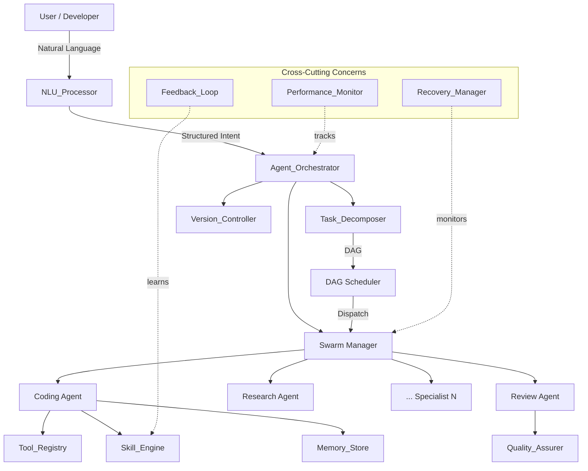
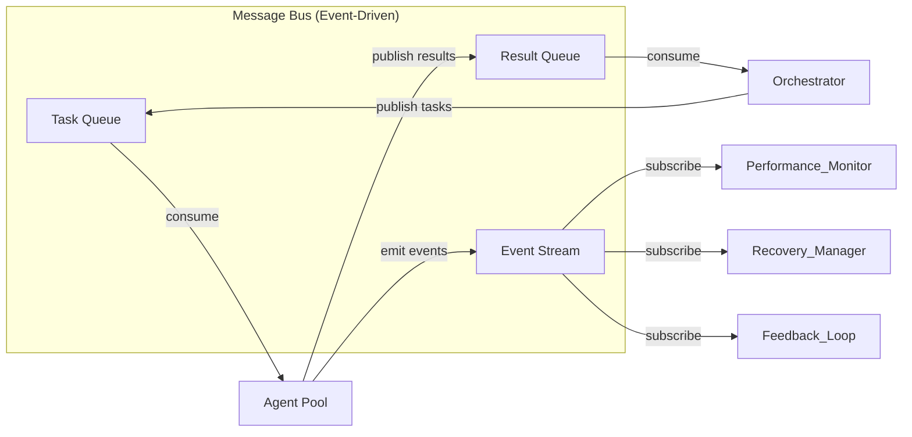
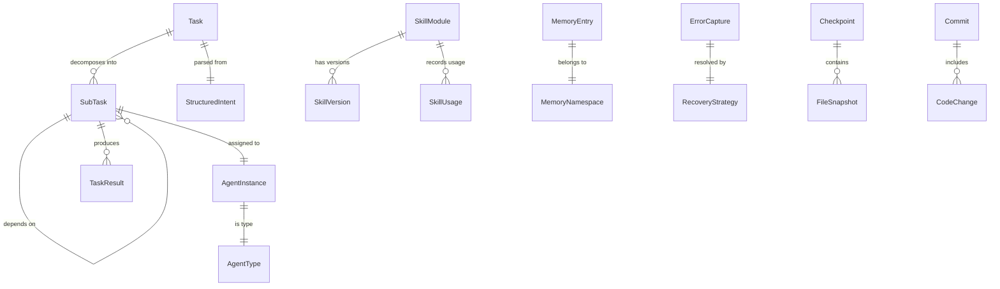
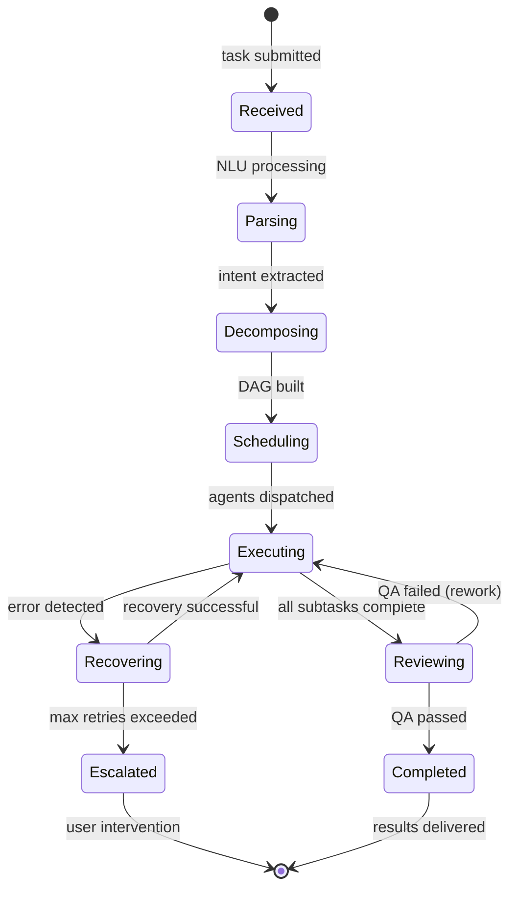
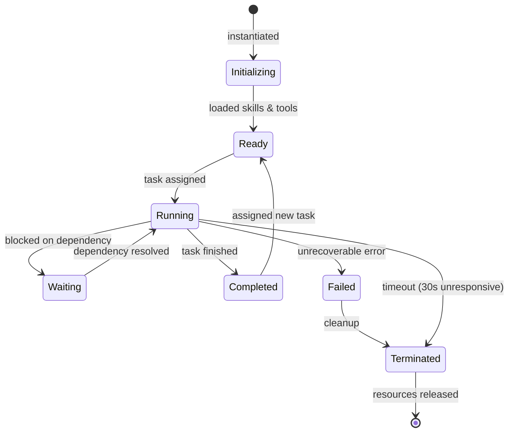

# Technical Design: Autonomous Coding Agent

## Overview

This document details the technical design for an Autonomous Coding Agent — a multi-agent system capable of independently executing complex software development tasks. The system employs a hierarchical orchestration pattern with a central coordinator (Agent_Orchestrator) managing specialized worker agents, a DAG-based task execution engine for parallel processing, persistent memory with semantic retrieval, and self-healing capabilities.

The architecture draws from established multi-agent orchestration patterns: a **Supervisor/Hierarchical** pattern for coordination, **DAG-based pipeline** for task execution, and **event-driven messaging** for inter-agent communication. This hybrid approach balances control (via centralized orchestration) with scalability (via parallel agent execution).

### Key Design Decisions

| Decision | Choice | Rationale |
|----------|--------|-----------|
| Orchestration Pattern | Hierarchical Supervisor | Central control over specialized agents enables reliable task routing and conflict resolution |
| Task Execution Model | DAG-based with topological scheduling | Explicit dependency modeling enables maximum parallelism while maintaining correctness |
| Memory Architecture | Hybrid (Vector DB + Graph DB + KV Store) | Different memory types serve different retrieval patterns (semantic, relational, exact-match) |
| Communication | Event-driven message bus | Decouples agents, enables async processing, supports replay and audit |
| Error Recovery | MAPE-K loop (Monitor-Analyze-Plan-Execute-Knowledge) | Proven autonomic computing pattern for self-healing systems |
| Skill Storage | Versioned skill modules with metadata | Enables evolution, rollback, and confidence-based selection |


## Architecture

### High-Level Architecture Diagram



### Layered Architecture

The system follows a four-layer architecture:

1. **Interface Layer**: NLU_Processor, user-facing API
2. **Orchestration Layer**: Agent_Orchestrator, Task_Decomposer, DAG Scheduler
3. **Execution Layer**: Agent Swarm, Skill_Engine, Tool_Registry, Quality_Assurer
4. **Infrastructure Layer**: Memory_Store, Version_Controller, Performance_Monitor, Recovery_Manager


### Communication Architecture



All inter-component communication flows through an event-driven message bus. This provides:
- **Decoupling**: Components communicate without direct dependencies
- **Auditability**: All messages are logged for replay and debugging
- **Resilience**: Failed consumers don't block producers
- **Scalability**: Multiple consumers can process messages in parallel


## Components and Interfaces

### 1. NLU_Processor

**Responsibility**: Interprets natural language task descriptions and produces structured intents.

```typescript
interface NLUProcessor {
  parseInstruction(input: string, context: ProjectContext): Promise<StructuredIntent>;
  detectAmbiguity(intent: StructuredIntent): AmbiguityReport;
  generateClarifications(report: AmbiguityReport): ClarifyingQuestion[];
  resolveReferences(intent: StructuredIntent, memory: MemoryStore): Promise<ResolvedIntent>;
  detectContradictions(intent: StructuredIntent): Contradiction[];
}

interface StructuredIntent {
  actionType: ActionType;
  targetScope: TargetScope;
  constraints: Constraint[];
  successCriteria: SuccessCriterion[];
  language: string; // normalized internal representation
  confidence: number;
  rawInput: string;
}

type ActionType = 'create' | 'modify' | 'refactor' | 'fix' | 'test' | 'document' | 'deploy' | 'analyze';

interface TargetScope {
  files: string[];
  modules: string[];
  functions: string[];
  scope: 'file' | 'module' | 'project' | 'function';
}
```

### 2. Agent_Orchestrator

**Responsibility**: Central coordinator that manages agent lifecycle, task delegation, and result aggregation.

```typescript
interface AgentOrchestrator {
  receiveTask(intent: ResolvedIntent): Promise<TaskExecution>;
  instantiateAgents(plan: DecompositionPlan): Promise<AgentInstance[]>;
  monitorAgents(instances: AgentInstance[]): AsyncIterable<AgentEvent>;
  collectResult(agentId: string, result: TaskResult): Promise<void>;
  resolveConflict(conflicts: MergeConflict[]): Promise<Resolution>;
  terminateAgent(agentId: string, reason: string): Promise<void>;
}

interface AgentInstance {
  id: string;
  type: AgentType;
  specialization: string;
  status: AgentStatus;
  assignedTask: SubTask;
  resourceAllocation: ResourceLimits;
  startTime: number;
  lastHeartbeat: number;
}

type AgentStatus = 'initializing' | 'running' | 'waiting' | 'completed' | 'failed' | 'terminated';
type AgentType = 'coding' | 'review' | 'research' | 'testing' | 'documentation' | 'refactoring';
```


### 3. Task_Decomposer

**Responsibility**: Analyzes complex tasks and produces a DAG of subtasks with dependency relationships.

```typescript
interface TaskDecomposer {
  decompose(intent: ResolvedIntent, context: ProjectContext): Promise<DecompositionPlan>;
  estimateComplexity(subtask: SubTask): ComplexityScore;
  identifyDependencies(subtasks: SubTask[]): DependencyGraph;
  reEvaluate(plan: DecompositionPlan, contextChange: ContextChange): Promise<DecompositionPlan>;
}

interface DecompositionPlan {
  id: string;
  rootTask: ResolvedIntent;
  subtasks: SubTask[];
  dependencyGraph: DependencyGraph;
  estimatedDuration: number;
  parallelismFactor: number;
}

interface SubTask {
  id: string;
  parentId: string;
  description: string;
  priority: Priority;
  complexityScore: number;
  dependencies: string[]; // subtask IDs
  recommendedAgentType: AgentType;
  estimatedDuration: number;
  maxRetries: number;
}

interface DependencyGraph {
  nodes: Map<string, SubTask>;
  edges: DirectedEdge[];
  topologicalOrder: string[];
  criticalPath: string[];
  parallelGroups: string[][]; // groups of tasks that can run concurrently
}
```

### 4. DAG Scheduler

**Responsibility**: Executes the dependency graph, dispatching ready tasks and managing parallel execution.

```typescript
interface DAGScheduler {
  schedule(graph: DependencyGraph): ExecutionPlan;
  getReadyTasks(state: ExecutionState): SubTask[];
  markComplete(taskId: string, result: TaskResult): void;
  markFailed(taskId: string, error: ExecutionError): void;
  getParallelismMetrics(): ParallelismMetrics;
}

interface ExecutionPlan {
  waves: ExecutionWave[]; // groups of parallel tasks
  totalEstimatedTime: number;
  maxConcurrency: number;
}

interface ExecutionWave {
  waveIndex: number;
  tasks: SubTask[];
  prerequisites: string[]; // wave indices that must complete first
}

interface ParallelismMetrics {
  wallClockTime: number;
  cumulativeAgentTime: number;
  parallelismRatio: number; // cumulative / wall-clock
  maxConcurrentAgents: number;
}
```


### 5. Skill_Engine

**Responsibility**: Manages the lifecycle of reusable skill modules — creation, retrieval, evolution, and retirement.

```typescript
interface SkillEngine {
  findSkill(query: SkillQuery): Promise<SkillModule | null>;
  generateSkill(taskRequirements: TaskRequirements): Promise<SkillModule>;
  recordUsage(skillId: string, outcome: SkillOutcome): Promise<void>;
  refineSkill(skillId: string, failureAnalysis: FailureAnalysis): Promise<SkillModule>;
  searchSkills(criteria: SearchCriteria): Promise<SkillModule[]>;
}

interface SkillModule {
  id: string;
  version: number;
  name: string;
  description: string;
  categories: string[];
  programmingLanguages: string[];
  domainContexts: string[];
  solutionTemplate: string;
  confidenceScore: number;
  usageCount: number;
  successRate: number;
  createdAt: number;
  updatedAt: number;
  versionHistory: SkillVersion[];
}

interface SkillQuery {
  taskCategory: string;
  language?: string;
  domain?: string;
  minConfidence?: number;
}

interface SkillOutcome {
  success: boolean;
  context: string;
  executionTime: number;
  userFeedback?: string;
}
```

### 6. Memory_Store

**Responsibility**: Persistent storage with semantic retrieval across multiple namespaces.

```typescript
interface MemoryStore {
  store(entry: MemoryEntry): Promise<string>;
  retrieve(query: MemoryQuery): Promise<MemoryEntry[]>;
  getProjectContext(projectId: string): Promise<ProjectContext>;
  applyDecay(): Promise<DecayReport>;
  getNamespace(ns: MemoryNamespace): NamespacedStore;
}

interface MemoryEntry {
  id: string;
  namespace: MemoryNamespace;
  content: string;
  embedding: number[];
  metadata: MemoryMetadata;
  relevanceScore: number;
  accessCount: number;
  lastAccessed: number;
  createdAt: number;
}

type MemoryNamespace = 'project' | 'patterns' | 'preferences' | 'decisions' | 'lessons';

interface MemoryQuery {
  semanticQuery: string;
  namespace?: MemoryNamespace;
  projectId?: string;
  maxResults?: number;
  minRelevance?: number;
  timeRange?: TimeRange;
}

interface MemoryMetadata {
  taskId?: string;
  projectId?: string;
  language?: string;
  domain?: string;
  tags: string[];
  outcome?: 'success' | 'failure' | 'partial';
}
```


### 7. Tool_Registry

**Responsibility**: Manages tools, creates new integrations, and provides discovery to agents.

```typescript
interface ToolRegistry {
  findTool(requirement: ToolRequirement): Promise<Tool | null>;
  createTool(spec: ToolSpecification): Promise<Tool>;
  validateTool(tool: Tool): Promise<ValidationResult>;
  registerTool(tool: Tool): Promise<void>;
  createIntegrationAdapter(service: ExternalService): Promise<IntegrationAdapter>;
}

interface Tool {
  id: string;
  name: string;
  description: string;
  interfaceDefinition: InterfaceDefinition;
  inputSchema: JSONSchema;
  outputSchema: JSONSchema;
  implementation: string;
  tests: TestSuite;
  documentation: string;
  safetyChecklist: SafetyCheckResult;
  status: 'draft' | 'validated' | 'active' | 'deprecated';
}

interface IntegrationAdapter {
  serviceId: string;
  endpoint: string;
  retryPolicy: RetryPolicy;
  rateLimiter: RateLimitConfig;
  fallbackStrategy: FallbackStrategy;
  timeout: number;
}

interface RetryPolicy {
  maxRetries: number;
  backoffStrategy: 'linear' | 'exponential' | 'fibonacci';
  initialDelay: number;
  maxDelay: number;
}
```

### 8. Recovery_Manager

**Responsibility**: Detects failures, diagnoses root causes, and executes self-healing strategies using the MAPE-K loop.

```typescript
interface RecoveryManager {
  captureError(error: RuntimeError, context: ExecutionContext): Promise<ErrorCapture>;
  classifyError(capture: ErrorCapture): ErrorClassification;
  selectStrategy(classification: ErrorClassification): RecoveryStrategy;
  executeRecovery(strategy: RecoveryStrategy, context: ExecutionContext): Promise<RecoveryResult>;
  detectDegradation(metrics: PerformanceMetrics): DegradationAlert[];
  escalate(issue: UnrecoverableIssue): Promise<EscalationReport>;
}

interface ErrorCapture {
  id: string;
  timestamp: number;
  errorType: string;
  message: string;
  stackTrace: string;
  inputState: any;
  executionHistory: ExecutionStep[];
  agentId: string;
  taskId: string;
}

interface RecoveryStrategy {
  id: string;
  name: string;
  applicableErrors: string[];
  steps: RecoveryStep[];
  maxAttempts: number;
  successRate: number;
}

interface RecoveryResult {
  success: boolean;
  strategyUsed: string;
  attemptsNeeded: number;
  timeToRecover: number;
  sideEffects: string[];
}
```


### 9. Quality_Assurer

**Responsibility**: Automated code review, standards enforcement, and output validation.

```typescript
interface QualityAssurer {
  reviewCode(code: CodeOutput, standards: CodingStandards): Promise<ReviewResult>;
  verifyErrorHandling(code: CodeOutput): CoverageReport;
  runStaticAnalysis(code: CodeOutput): StaticAnalysisResult;
  checkTestCoverage(code: CodeOutput, existingTests: TestSuite): CoverageReport;
  enforceStandards(code: CodeOutput, config: ProjectConfig): ComplianceResult;
}

interface ReviewResult {
  passed: boolean;
  issues: QualityIssue[];
  suggestions: Suggestion[];
  metrics: QualityMetrics;
}

interface QualityIssue {
  severity: 'error' | 'warning' | 'info';
  category: 'lint' | 'type' | 'pattern' | 'security' | 'performance';
  location: CodeLocation;
  message: string;
  remediation: string;
  autoFixable: boolean;
}

interface QualityMetrics {
  lintScore: number;
  typeCheckPassed: boolean;
  testCoverage: number;
  cyclomaticComplexity: number;
  documentationCoverage: number;
}
```

### 10. Version_Controller

**Responsibility**: Manages code changes, checkpoints, branching, and rollback capabilities.

```typescript
interface VersionController {
  createCheckpoint(taskId: string, affectedFiles: string[]): Promise<Checkpoint>;
  commitChanges(taskId: string, changes: CodeChange[], message: string): Promise<Commit>;
  rollback(taskId: string): Promise<RollbackResult>;
  detectConflicts(changes: CodeChange[][]): MergeConflict[];
  createBranch(name: string, baseBranch: string): Promise<Branch>;
  mergeBranch(source: string, target: string): Promise<MergeResult>;
}

interface Checkpoint {
  id: string;
  taskId: string;
  timestamp: number;
  fileSnapshots: FileSnapshot[];
  branchName: string;
}

interface CodeChange {
  filePath: string;
  changeType: 'create' | 'modify' | 'delete' | 'rename';
  diff: string;
  agentId: string;
  taskId: string;
}

interface RollbackResult {
  success: boolean;
  revertedFiles: string[];
  preservedFiles: string[];
  conflictsEncountered: MergeConflict[];
}
```


### 11. Feedback_Loop

**Responsibility**: Captures feedback signals and drives continuous improvement.

```typescript
interface FeedbackLoop {
  recordExplicitFeedback(taskId: string, correction: UserCorrection): Promise<void>;
  recordImplicitFeedback(taskId: string, accepted: boolean): Promise<void>;
  extractCorrectionPattern(correction: UserCorrection): CorrectionPattern;
  getAcceptanceRate(category: string): number;
  detectRecurringPatterns(): RecurringPattern[];
  generateRule(pattern: RecurringPattern): QualityRule;
}

interface UserCorrection {
  originalOutput: string;
  correctedOutput: string;
  explanation?: string;
  affectedSkillId?: string;
}

interface CorrectionPattern {
  patternType: string;
  rootCause: string;
  affectedCategories: string[];
  suggestedFix: string;
  frequency: number;
}

interface RecurringPattern {
  patternId: string;
  occurrences: number;
  categories: string[];
  examples: CorrectionPattern[];
  generalizableRule: string;
}
```

### 12. Performance_Monitor

**Responsibility**: Tracks metrics, identifies optimization opportunities, and manages resource allocation.

```typescript
interface PerformanceMonitor {
  recordExecution(taskId: string, metrics: ExecutionMetrics): Promise<void>;
  getBaseline(category: string): BaselineMetrics;
  detectAnomalies(metrics: ExecutionMetrics, baseline: BaselineMetrics): Anomaly[];
  generateReport(timeRange: TimeRange): PerformanceReport;
  identifyIdleAgents(threshold: number): AgentInstance[];
  flagForOptimization(operationType: string, metrics: ExecutionMetrics): OptimizationSuggestion;
}

interface ExecutionMetrics {
  taskId: string;
  agentId: string;
  category: string;
  executionTime: number;
  resourceConsumption: ResourceUsage;
  successRate: number;
  qualityScore: number;
  timestamp: number;
}

interface BaselineMetrics {
  category: string;
  meanExecutionTime: number;
  stdDevExecutionTime: number;
  meanResourceUsage: ResourceUsage;
  sampleSize: number;
}

interface PerformanceReport {
  period: TimeRange;
  throughput: number;
  errorRate: number;
  avgResponseTime: number;
  resourceUtilization: number;
  improvementTrend: number;
  topBottlenecks: string[];
}
```


## Data Models

### Core Entities



### Task Execution State Machine



### Agent Lifecycle State Machine




### Key Data Structures

#### Task & Execution

```typescript
interface Task {
  id: string;
  intent: ResolvedIntent;
  status: TaskStatus;
  decompositionPlan: DecompositionPlan;
  executionTimeline: ExecutionEvent[];
  result: TaskResult | null;
  createdAt: number;
  completedAt: number | null;
}

type TaskStatus = 'received' | 'parsing' | 'decomposing' | 'scheduling' | 'executing' | 'reviewing' | 'completed' | 'failed' | 'escalated';

interface TaskResult {
  taskId: string;
  subtaskResults: SubTaskResult[];
  codeChanges: CodeChange[];
  qualityReport: ReviewResult;
  metrics: ParallelismMetrics;
  totalDuration: number;
}

interface SubTaskResult {
  subtaskId: string;
  agentId: string;
  output: any;
  duration: number;
  retries: number;
  status: 'success' | 'failed' | 'skipped';
}
```

#### Skill Versioning

```typescript
interface SkillVersion {
  version: number;
  skillId: string;
  template: string;
  changelog: string;
  confidenceScore: number;
  createdAt: number;
  refinementSource: 'auto' | 'feedback' | 'failure_analysis';
}

interface SkillUsage {
  id: string;
  skillId: string;
  skillVersion: number;
  taskId: string;
  outcome: SkillOutcome;
  timestamp: number;
}
```

#### Memory & Knowledge

```typescript
interface ProjectContext {
  projectId: string;
  structure: FileTree;
  dependencies: DependencyGraph;
  codingStandards: CodingStandards;
  recentChanges: Commit[];
  activeAgents: AgentInstance[];
  userPreferences: UserPreferences;
}

interface DecayConfig {
  capacityThreshold: number; // bytes
  decayRate: number; // relevance reduction per day
  preservationThreshold: number; // min relevance to keep
  highImpactBoost: number; // relevance boost for high-impact entries
}
```

#### Communication Messages

```typescript
interface AgentMessage {
  id: string;
  type: MessageType;
  senderId: string;
  recipientId: string | 'broadcast';
  payload: any;
  timestamp: number;
  correlationId: string; // links related messages
}

type MessageType = 
  | 'task_assignment'
  | 'result_submission'
  | 'assistance_request'
  | 'intermediate_result'
  | 'heartbeat'
  | 'termination'
  | 'conflict_detected'
  | 'dependency_resolved';
```


## Correctness Properties

*A property is a characteristic or behavior that should hold true across all valid executions of a system — essentially, a formal statement about what the system should do. Properties serve as the bridge between human-readable specifications and machine-verifiable correctness guarantees.*

### Property 1: Skill generation produces valid modules

*For any* task requirement set where no matching skill exists in the Skill_Engine, generating a new skill SHALL produce a SkillModule with non-empty name, description, at least one category, a valid solutionTemplate, and an initial confidence score.

**Validates: Requirements 1.1, 1.2**

### Property 2: Skill persistence round-trip

*For any* SkillModule persisted to the Skill_Engine, retrieving it by its indexed attributes (category, language, domain) SHALL return an equivalent module with all metadata intact (creation timestamp, categories, success rate, version history).

**Validates: Requirements 1.2, 1.5**

### Property 3: Skill confidence monotonically increases on success

*For any* existing SkillModule with confidence score C, recording a successful outcome SHALL result in a new confidence score C' where C' > C.

**Validates: Requirements 1.3**

### Property 4: Skill refinement on failure

*For any* SkillModule that produces a failed outcome, the Skill_Engine SHALL produce a new version with a version number strictly greater than the previous, incorporating the failure analysis.

**Validates: Requirements 1.4**

### Property 5: Agent specialization coverage

*For any* task requirement set, the set of instantiated agents' combined specializations SHALL cover all capabilities required by the task.

**Validates: Requirements 2.2**


### Property 6: Dependency completion triggers ready notification

*For any* DAG and any completed subtask node, all directly dependent nodes whose remaining prerequisites are now satisfied SHALL be marked as ready for execution.

**Validates: Requirements 2.4**

### Property 7: Unresponsive agent detection and reassignment

*For any* agent instance whose lastHeartbeat timestamp is more than 30 seconds before the current time, the system SHALL terminate that agent and create a reassignment of its subtask to a new instance.

**Validates: Requirements 2.5**

### Property 8: Independent subtasks scheduled in parallel

*For any* set of subtasks within a DAG that share no dependency edges between them, they SHALL appear in the same execution wave (i.e., eligible for concurrent execution).

**Validates: Requirements 3.1**

### Property 9: Resource allocation cap enforcement

*For any* set of concurrently running agents, no single agent's resource allocation SHALL exceed 40% of total available compute resources.

**Validates: Requirements 3.2**

### Property 10: Overlapping code region conflict detection

*For any* two code changes produced by parallel subtasks that modify overlapping line ranges within the same file, the system SHALL detect and report a merge conflict.

**Validates: Requirements 3.3**

### Property 11: Parallelism metrics correctness

*For any* set of completed parallel task executions with recorded start/end times, the computed parallelism ratio SHALL equal the sum of individual task durations divided by the total wall-clock elapsed time.

**Validates: Requirements 3.4**


### Property 12: Reasoning chain structural completeness

*For any* task requiring architectural decisions, the generated reasoning chain SHALL contain at least one problem decomposition, one constraint identification, one alternative evaluation, and one decision justification element.

**Validates: Requirements 4.1, 4.2**

### Property 13: Reasoning chain checkpoint invariant

*For any* reasoning trace with more than 10 logical steps, there SHALL be at least one intermediate summary checkpoint inserted within the trace.

**Validates: Requirements 4.4**

### Property 14: Memory persistence round-trip

*For any* MemoryEntry stored in the Memory_Store, retrieving it after a simulated restart SHALL return data identical to what was stored, with no field loss or corruption.

**Validates: Requirements 5.1**

### Property 15: Memory namespace isolation

*For any* MemoryEntry stored in namespace A, querying namespace B with any query SHALL never return that entry in results.

**Validates: Requirements 5.5**

### Property 16: Memory relevance-decay preserves high-impact entries

*For any* Memory_Store at capacity with entries of varying relevance scores, after applying the decay algorithm, all remaining entries SHALL have relevance scores above the configured preservation threshold, and no entry with relevance above the high-impact boost threshold SHALL have been archived.

**Validates: Requirements 5.4**

### Property 17: Error capture completeness

*For any* runtime error encountered during agent execution, the resulting ErrorCapture SHALL contain a non-empty stackTrace, non-null inputState, and at least one executionHistory entry.

**Validates: Requirements 6.1**


### Property 18: Error classification and strategy selection

*For any* valid ErrorCapture, classification SHALL produce a non-null ErrorClassification, and strategy selection SHALL return a RecoveryStrategy whose applicableErrors includes the classified error type.

**Validates: Requirements 6.2**

### Property 19: Recovery escalation after max retries

*For any* error where the selected recovery strategy fails on every attempt, after exactly 3 failed attempts the system SHALL escalate to the user rather than retry, producing an EscalationReport with diagnostic summary.

**Validates: Requirements 6.3**

### Property 20: Degradation detection threshold

*For any* performance metric where the current value exceeds 2x the baseline mean for that metric category, the Recovery_Manager SHALL generate a DegradationAlert.

**Validates: Requirements 6.5**

### Property 21: Tool specification completeness

*For any* tool requirement with no matching tool in the registry, the generated ToolSpecification SHALL contain a valid interfaceDefinition, inputSchema conforming to JSON Schema, and outputSchema conforming to JSON Schema.

**Validates: Requirements 7.1**

### Property 22: Tool safety validation

*For any* tool lacking input sanitization, resource limits, or sandboxed execution configuration, the safety validation SHALL fail and prevent activation.

**Validates: Requirements 7.3**

### Property 23: Feedback pattern extraction

*For any* user correction where originalOutput differs from correctedOutput, the extracted CorrectionPattern SHALL have a non-empty rootCause and at least one affectedCategory.

**Validates: Requirements 8.1**


### Property 24: Acceptance rate flagging threshold

*For any* task category where the number of accepted outputs divided by total outputs is below 0.70, that category SHALL appear in the flagged-for-retraining list.

**Validates: Requirements 8.3**

### Property 25: Recurring pattern rule generation

*For any* set of corrections where the same patternType appears 3 or more times, the Feedback_Loop SHALL generate a generalized QualityRule covering that pattern.

**Validates: Requirements 8.4**

### Property 26: Quality issue remediation completeness

*For any* QualityIssue detected by the Quality_Assurer, the remediation field SHALL be non-empty and the issue SHALL be returned to the originating agent.

**Validates: Requirements 9.3**

### Property 27: Coding standards enforcement

*For any* code output that violates a configured naming convention, documentation requirement, or architectural pattern, the compliance check SHALL return a failure result identifying the specific violation.

**Validates: Requirements 9.4**

### Property 28: DAG acyclicity invariant

*For any* decomposition plan produced by the Task_Decomposer, the resulting dependency graph SHALL be a valid directed acyclic graph (topological sort succeeds without cycle detection).

**Validates: Requirements 10.3**

### Property 29: Leaf task complexity bound

*For any* final decomposition plan, all leaf subtasks (nodes with no children) SHALL have a complexityScore at or below the configured single-agent capacity threshold.

**Validates: Requirements 10.4**


### Property 30: Checkpoint captures all affected files

*For any* task that modifies a set of files, the created checkpoint SHALL contain file snapshots for every file in that set, and each snapshot's content SHALL match the file's pre-modification state.

**Validates: Requirements 11.1**

### Property 31: Rollback isolation

*For any* two tasks A and B with non-overlapping file modifications, rolling back task A SHALL preserve all of task B's changes unchanged.

**Validates: Requirements 11.3**

### Property 32: Merge conflict proactive detection

*For any* two sets of CodeChanges from different agents that modify overlapping line ranges in the same file, the Version_Controller SHALL detect and report at least one MergeConflict before integration.

**Validates: Requirements 11.5**

### Property 33: NLU structured intent extraction

*For any* non-empty natural language input, the NLU_Processor SHALL produce a StructuredIntent with a valid actionType (from the defined enum), non-null targetScope, and a confidence score between 0 and 1.

**Validates: Requirements 12.1**

### Property 34: Cross-language intent normalization

*For any* semantically equivalent task description expressed in two different supported languages, the NLU_Processor SHALL produce internal representations with the same actionType, equivalent targetScope, and equivalent constraints.

**Validates: Requirements 12.3**

### Property 35: Contradiction detection

*For any* task description containing two mutually exclusive requirements (e.g., "make it synchronous" and "make it asynchronous"), the NLU_Processor SHALL detect and report at least one Contradiction.

**Validates: Requirements 12.5**

### Property 36: Performance anomaly detection

*For any* execution metric value where the absolute deviation from the baseline mean exceeds either 50% of the time budget OR 2 standard deviations from the baseline, the Performance_Monitor SHALL generate an alert or optimization flag.

**Validates: Requirements 13.2, 13.5**

### Property 37: Idle agent resource release

*For any* agent instance with no assigned task and idle time exceeding 60 seconds, the Agent_Orchestrator SHALL release that agent's resources back to the available pool.

**Validates: Requirements 13.4**


## Error Handling

### Error Classification Hierarchy

```
RuntimeError
├── AgentError
│   ├── AgentTimeout (>30s no heartbeat)
│   ├── AgentCrash (unexpected termination)
│   ├── AgentResourceExhaustion (exceeded 40% cap)
│   └── AgentSkillFailure (skill produced invalid output)
├── TaskError
│   ├── DecompositionError (cyclic dependency detected)
│   ├── ConflictError (parallel outputs clash)
│   ├── ComplexityOverflow (cannot decompose further)
│   └── DependencyTimeout (blocked subtask never unblocks)
├── MemoryError
│   ├── StorageFailure (persistence write failed)
│   ├── RetrievalTimeout (>1s retrieval time)
│   └── NamespaceCorruption (cross-contamination detected)
├── ToolError
│   ├── ToolValidationFailure (safety check failed)
│   ├── ExternalServiceFailure (API call failed)
│   ├── RateLimitExceeded (adapter rate limited)
│   └── ToolGenerationFailure (cannot create tool)
└── QualityError
    ├── StaticAnalysisFailure (lint/type errors)
    ├── TestRegressionFailure (existing tests broken)
    └── CoverageDecreaseFailure (test coverage dropped)
```

### Recovery Strategy Matrix

| Error Type | Strategy | Max Retries | Escalation |
|-----------|----------|-------------|------------|
| AgentTimeout | Terminate + Reassign | 3 | Yes - recommend task simplification |
| AgentCrash | Restart from checkpoint | 3 | Yes - include crash dump |
| DecompositionError | Re-decompose with relaxed constraints | 2 | Yes - show cycle details |
| ConflictError | Invoke Reasoning_Engine for merge | 1 | Yes - present both versions |
| StorageFailure | Retry with exponential backoff | 5 | Yes - data integrity risk |
| ExternalServiceFailure | Retry with backoff + fallback | 3 | Yes - suggest manual API call |
| StaticAnalysisFailure | Return to coding agent for fix | 3 | Yes - show unfixable issues |
| TestRegressionFailure | Rollback + re-attempt with constraints | 2 | Yes - show broken tests |

### Error Propagation Rules

1. **Contained errors**: Errors within a single subtask do NOT propagate to other subtasks unless they share dependencies
2. **Cascading failures**: If a subtask fails and dependent subtasks cannot proceed, they are suspended (not failed)
3. **Critical path errors**: Errors on the critical path trigger immediate re-evaluation of the execution plan
4. **Resource errors**: Resource exhaustion triggers graceful degradation (reduce parallelism) before failing

### Graceful Degradation Modes

| Trigger | Degradation Action |
|---------|-------------------|
| Memory > 80% capacity | Apply aggressive decay, reduce concurrent retrievals |
| Agent pool exhausted | Queue new tasks, serialize previously-parallel work |
| External API unavailable | Switch to cached results + offline mode |
| Quality check timeout | Deliver with warning, schedule async review |


## Testing Strategy

### Dual Testing Approach

This system uses both property-based testing and example-based unit testing for comprehensive coverage:

- **Property-Based Tests**: Verify universal correctness properties (37 properties defined above) across randomized inputs
- **Unit Tests**: Verify specific examples, edge cases, integration points, and error conditions
- **Integration Tests**: Verify cross-component communication, message bus routing, and external service adapters

### Property-Based Testing Configuration

**Library**: [fast-check](https://github.com/dubzzz/fast-check) (TypeScript property-based testing)

**Configuration**:
- Minimum 100 iterations per property test
- Each property test references its design document property via tag comment
- Tag format: `// Feature: autonomous-coding-agent, Property {N}: {property_text}`

**Key Property Test Categories**:

| Category | Properties | Focus |
|----------|-----------|-------|
| Skill Engine | 1-4 | Generation, persistence, confidence updates, refinement |
| Orchestration | 5-11 | Agent selection, DAG scheduling, parallelism, conflict detection |
| Reasoning | 12-13 | Chain structure, checkpoint insertion |
| Memory | 14-16 | Round-trip, isolation, decay correctness |
| Recovery | 17-20 | Capture completeness, classification, escalation, degradation |
| Tools | 21-22 | Spec completeness, safety validation |
| Feedback | 23-25 | Pattern extraction, thresholds, rule generation |
| Quality | 26-27 | Remediation, standards enforcement |
| Task Decomposition | 28-29 | DAG acyclicity, leaf complexity bounds |
| Version Control | 30-32 | Checkpoints, rollback isolation, conflict detection |
| NLU | 33-35 | Intent extraction, normalization, contradiction detection |
| Performance | 36-37 | Anomaly detection, idle resource release |

### Custom Generators (fast-check Arbitraries)

Property tests require custom generators for domain-specific types:

```typescript
// Example generators for key domain types
const arbSubTask = fc.record({
  id: fc.uuid(),
  parentId: fc.uuid(),
  description: fc.string({ minLength: 1, maxLength: 200 }),
  priority: fc.constantFrom('critical', 'high', 'medium', 'low'),
  complexityScore: fc.float({ min: 0, max: 100 }),
  dependencies: fc.array(fc.uuid(), { maxLength: 5 }),
  recommendedAgentType: fc.constantFrom('coding', 'review', 'research', 'testing'),
  estimatedDuration: fc.integer({ min: 100, max: 300000 }),
  maxRetries: fc.integer({ min: 1, max: 5 }),
});

const arbSkillModule = fc.record({
  id: fc.uuid(),
  version: fc.integer({ min: 1, max: 100 }),
  name: fc.string({ minLength: 1, maxLength: 50 }),
  categories: fc.array(fc.string({ minLength: 1 }), { minLength: 1, maxLength: 5 }),
  programmingLanguages: fc.array(fc.constantFrom('typescript', 'python', 'java', 'go')),
  confidenceScore: fc.float({ min: 0, max: 1 }),
  successRate: fc.float({ min: 0, max: 1 }),
});

const arbMemoryEntry = fc.record({
  id: fc.uuid(),
  namespace: fc.constantFrom('project', 'patterns', 'preferences', 'decisions', 'lessons'),
  content: fc.string({ minLength: 1, maxLength: 1000 }),
  relevanceScore: fc.float({ min: 0, max: 1 }),
  accessCount: fc.integer({ min: 0, max: 10000 }),
});

const arbDAG = fc.integer({ min: 2, max: 20 }).chain(nodeCount =>
  // Generate a valid DAG by ensuring edges only go from lower to higher indices
  fc.tuple(
    fc.array(arbSubTask, { minLength: nodeCount, maxLength: nodeCount }),
    fc.array(
      fc.tuple(
        fc.integer({ min: 0, max: nodeCount - 2 }),
        fc.integer({ min: 1, max: nodeCount - 1 })
      ).filter(([from, to]) => from < to),
      { maxLength: nodeCount * 2 }
    )
  )
);
```

### Unit Test Coverage Areas

1. **Edge Cases**:
   - Empty task descriptions
   - Single-node DAGs (no parallelism)
   - Maximum recursion depth in task decomposition
   - Memory store at exactly capacity threshold
   - Agent heartbeat at exactly 30 seconds

2. **Integration Points**:
   - Message bus routing between Orchestrator and Agents
   - Memory_Store write-then-read consistency
   - Tool_Registry activation after validation
   - Version_Controller branch creation and merge

3. **Error Conditions**:
   - Cyclic dependency injection into DAG builder
   - Invalid skill module schema
   - NLU_Processor with unsupported language input
   - Recovery_Manager with unknown error type

### Test Execution Plan

| Phase | Type | Scope | Runner |
|-------|------|-------|--------|
| 1 | Unit Tests | Individual component logic | vitest --run |
| 2 | Property Tests | All 37 correctness properties | vitest --run (fast-check) |
| 3 | Integration Tests | Cross-component messaging | vitest --run |
| 4 | End-to-End | Full task lifecycle | Custom harness |

